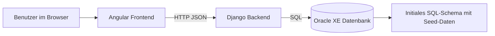
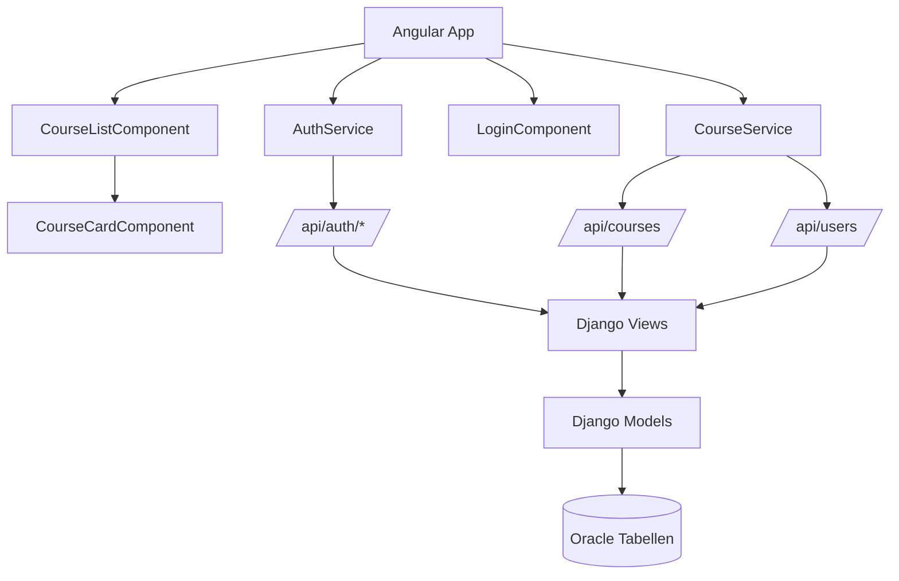
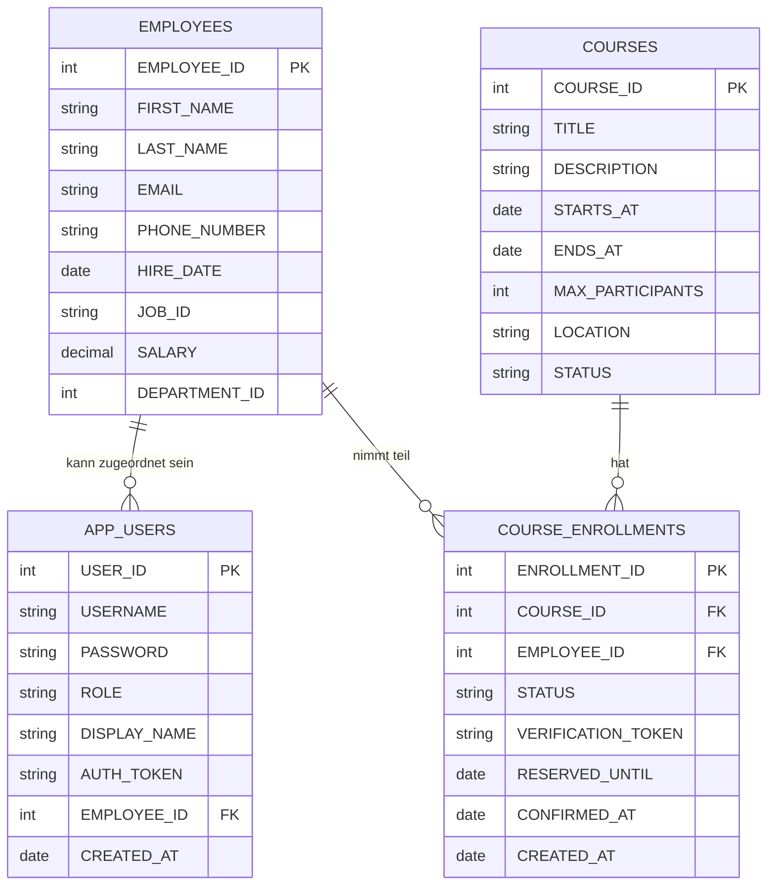
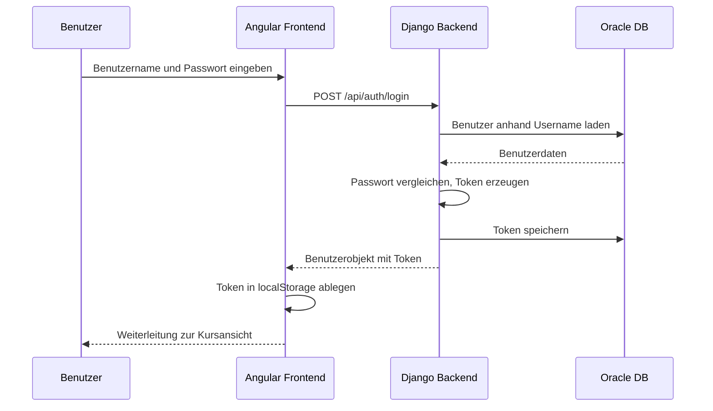
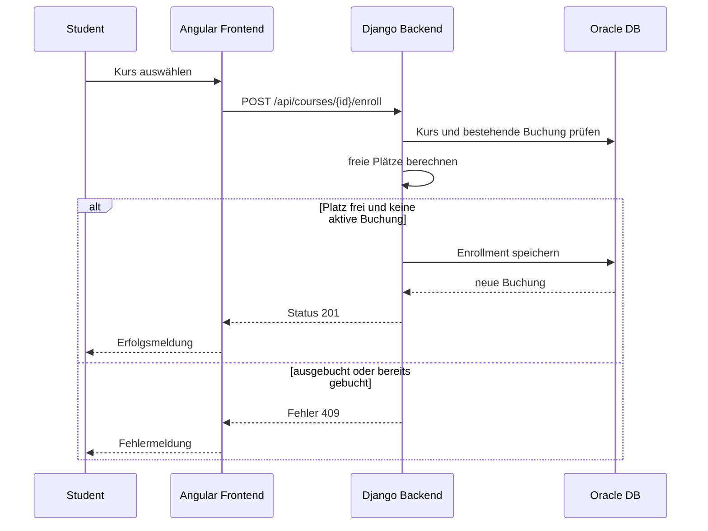

# Projektdokumentation Kursify

## 1. Einleitung

Im Projekt **Kursify** wurde eine webbasierte Anwendung zur Verwaltung von Schulungs- und Weiterbildungskursen entwickelt. Die Software ermöglicht es, Kurse zentral in einer Oracle-Datenbank zu speichern, Benutzende mit unterschiedlichen Rollen anzulegen und Kursbuchungen über eine Browseroberfläche durchzuführen. Die Anwendung besteht aus einem Django-Backend, einem Angular-Frontend sowie einer Oracle-XE-Datenbank, die über Docker Compose gemeinsam gestartet werden können.

Ziel des Projekts war es, einen lauffähigen Prototypen für die Kursverwaltung zu erstellen, der im nächsten Schuljahr weiterverwendet und erweitert werden kann. Die Anwendung richtet sich an zwei Benutzergruppen. Administratorinnen und Administratoren können neue Kurse und neue Benutzende anlegen. Schülerinnen, Schüler oder andere Teilnehmende können sich anmelden, verfügbare Kurse einsehen und sich für Kurse ein- oder austragen.

Die vorliegende Dokumentation orientiert sich an den typischen Phasen der Softwareentwicklung und ist in Anforderungsanalyse, Entwurf, Implementierung, Test und Deployment gegliedert. Zusätzlich werden Datenstrukturen, API, Codeaufbau, offene Punkte, unfertige Module und die Reflexion des Entwicklungsprozesses beschrieben. Ziel ist nicht nur die Darstellung des Endergebnisses, sondern auch die nachvollziehbare Erläuterung des Vorgehens, der getroffenen Entscheidungen und der aufgetretenen Probleme.

## 2. Projektziel und Problemstellung

Aus dem Code lässt sich ableiten, dass mit Kursify ein organisatorisches Problem gelöst werden sollte: Kurse sollen nicht mehr nur informell oder dezentral verwaltet werden, sondern in einer einheitlichen Datenbasis mit klarer Rollenverteilung. Die Software bildet dazu die zentralen Vorgänge einer einfachen Kursverwaltung ab:

- Anmeldung eines Benutzers
- Anzeige aller Kurse
- Anzeige freier Plätze
- Buchung und Stornierung von Kursen
- Anlage neuer Kurse
- Anlage neuer Benutzerkonten

Die eigentliche Problemlösung besteht darin, die Verwaltung der Kurse technisch so abzubilden, dass die wichtigsten Geschäftsregeln bereits im System berücksichtigt werden. Dazu gehören insbesondere:

- Nur angemeldete Benutzer dürfen Daten abrufen.
- Nur Administratoren dürfen Kurse und Benutzer anlegen.
- Nur Benutzer mit der Rolle `STUDENT` dürfen sich für Kurse anmelden.
- Ein Benutzer kann einen Kurs nicht mehrfach aktiv buchen.
- Ein Kurs kann nicht überbucht werden.

Übertragen auf die im Kriterium genannte Formulierung, wie man zur Lösung des Problems gekommen ist, bedeutet das für dieses Projekt: Die fachliche Lösung wurde dadurch erreicht, dass zunächst die beteiligten Objekte identifiziert wurden, anschließend ihre Beziehungen in einer relationalen Datenbank modelliert und danach die notwendigen Abläufe in Backend-Endpunkten sowie Frontend-Masken umgesetzt wurden.

## 3. Anforderungsanalyse

### 3.1 Funktionale Anforderungen

Die funktionalen Anforderungen lassen sich direkt aus den vorhandenen Modulen des Frontends und Backends ableiten.

**Benutzerbezogene Anforderungen**

- Ein Benutzer muss sich mit Benutzername und Passwort anmelden können.
- Ein Benutzer muss sich wieder abmelden können.
- Das System muss die aktuelle Benutzerrolle kennen.
- Administratoren müssen Benutzerkonten anlegen können.
- Bei Studierenden muss zusätzlich ein Mitarbeiterdatensatz angelegt werden.

**Kursbezogene Anforderungen**

- Angemeldete Benutzer müssen eine Liste aller Kurse laden können.
- Die Anwendung muss zu jedem Kurs Titel, Beschreibung, Datum, Ort und verfügbare Plätze anzeigen.
- Administratoren müssen neue Kurse anlegen können.
- Studierende müssen sich in Kurse eintragen können.
- Studierende müssen ihre Anmeldung zu einem Kurs wieder zurücknehmen können.
- Das System muss die Anzahl freier Plätze aus bestehenden Buchungen berechnen.

**Systembezogene Anforderungen**

- Die Anwendung soll lokal per Docker Compose startbar sein.
- Die Oracle-Datenbank soll beim Start automatisch mit Schema und Beispieldaten initialisiert werden.
- Frontend und Backend sollen getrennt entwickelt und betrieben werden können.

### 3.2 Nichtfunktionale Anforderungen

Auch mehrere nichtfunktionale Anforderungen sind aus dem Projekt ableitbar:

- Die Anwendung soll für Entwicklungszwecke einfach startbar sein.
- Die Oberfläche soll ohne zusätzliche Desktop-Software direkt im Browser nutzbar sein.
- Die Datenhaltung soll dauerhaft in einer relationalen Datenbank erfolgen.
- Der Code soll übersichtlich und erweiterbar aufgebaut sein.
- Das Projekt soll für eine spätere Weiterentwicklung im nächsten Schuljahr verständlich dokumentiert sein.

### 3.3 Abgrenzung des Projektumfangs

Der tatsächliche Projektumfang ist bewusst kleiner als der einer vollständig produktionsreifen Kursplattform. Mehrere typische Funktionen sind noch nicht umgesetzt oder nur vorbereitet:

- keine Passwortverschlüsselung
- keine E-Mail-Bestätigung
- keine Rollenverwaltung über ein Standard-Auth-System
- keine Bearbeitung oder Löschung vorhandener Kurse
- keine Historie oder Auswertung von Kursen
- keine produktionsreife Deployment-Strategie
- keine vollständige automatisierte Testabdeckung

Damit handelt es sich bei Kursify um einen **funktionalen Prototypen beziehungsweise eine Teillösung**, die das Kernproblem bereits löst, aber bewusst noch nicht alle Randfälle und Qualitätsanforderungen eines Echtbetriebs erfüllt.

## 4. Vorgehensweise zur Lösungsfindung

Die Vorgehensweise zur Erarbeitung der Lösung lässt sich aus dem Aufbau des Repositories gut nachvollziehen. Das Projekt wurde nicht als ein einziges Monolith-Skript umgesetzt, sondern in drei Schichten gegliedert:

1. Datenhaltung in Oracle
2. Geschäftslogik und API in Django
3. Benutzeroberfläche in Angular

Der Weg zur Lösung des Problems war fachlich sinnvoll, weil zunächst das Datenmodell festgelegt wurde. Die Tabellen `APP_USERS`, `COURSES` und `COURSE_ENROLLMENTS` bilden die Kernelemente der Anwendung. Darauf aufbauend wurden Django-Modelle erstellt, die direkt mit diesen Tabellen arbeiten. Anschließend wurden HTTP-Endpunkte implementiert, welche die notwendigen Aktionen kapseln. Erst danach wurde das Frontend ergänzt, das diese Endpunkte konsumiert und die Funktionalität für unterschiedliche Rollen visualisiert.

Dieser Weg ist deshalb nachvollziehbar, weil sich die wichtigsten Fragen zuerst auf Daten und Regeln beziehen:

- Welche Informationen muss ein Kurs enthalten?
- Wie wird ein Benutzer im System repräsentiert?
- Wie erkennt man, ob ein Kurs ausgebucht ist?
- Wie verhindert man doppelte Buchungen?
- Welche Aktionen sind für welche Rolle erlaubt?

Die Lösung wurde daher nicht nur technisch, sondern auch fachlich schrittweise entwickelt. Die Datenbank bildet die Wahrheit, das Backend sichert Regeln und Berechtigungen ab, und das Frontend stellt diese Funktionen benutzbar dar.

## 5. Systemübersicht

### 5.1 Gesamtarchitektur

Die Anwendung ist als einfache Drei-Schichten-Architektur umgesetzt.



Die technische Orchestrierung erfolgt über `docker-compose.yml`. Dort sind folgende Container vorgesehen:

- `db`: Oracle XE
- `schema-init`: einmalige Initialisierung des Schemas
- `django`: Backend-Service
- `angular`: Frontend-Service
- `ords`: Oracle REST Data Services
- `ollama`: lokaler KI-Dienst

Für die eigentliche Anwendung relevant und tatsächlich im Code angebunden sind jedoch nur **Oracle**, **Django** und **Angular**. Die Dienste `ords` und `ollama` sind im aktuellen Stand eher vorbereitende oder experimentelle Komponenten und werden in der Anwendung nicht aktiv genutzt.

### 5.2 Komponentenübersicht



## 6. Entwurfsphase

### 6.1 Fachliches Datenmodell

Das zentrale Datenmodell besteht aus den Entitäten `Employee`, `AppUser`, `Course` und `CourseEnrollment`.



### 6.2 Begründung der Datenmodellierung

Die Wahl dieses Datenmodells ist sinnvoll, weil damit sowohl fachliche als auch technische Anforderungen sauber getrennt werden:

- `EMPLOYEES` repräsentiert die Person im organisatorischen Sinn.
- `APP_USERS` repräsentiert den Login-Zugang.
- `COURSES` repräsentiert das eigentliche Kursangebot.
- `COURSE_ENROLLMENTS` verbindet Personen und Kurse.

Die zusätzliche Tabelle `APP_USERS` ist gegenüber einer direkten Anmeldung über `EMPLOYEES` ein guter Entwurfsentscheid, weil damit Rollen, Authentifizierungsdaten und Anzeigeinformationen getrennt von den eigentlichen Personendaten gespeichert werden können. Gleichzeitig ist sichtbar, dass die Lösung noch pragmatisch gehalten wurde: Studierende erhalten bei der Benutzeranlage automatisch auch einen `EMPLOYEE`-Datensatz.

### 6.3 Entwurf der Rollen und Berechtigungen

Im System sind zwei Rollen vorgesehen:

- `ADMIN`
- `STUDENT`

Die Rollen sind sowohl im SQL-Schema über einen Check Constraint als auch im Backend logisch berücksichtigt. Administratoren dürfen Benutzer und Kurse anlegen, Studierende dürfen Kurse buchen oder stornieren. Dieser Entwurf ist für einen Prototyp ausreichend, weil dadurch die wichtigsten Anwendungsfälle ohne komplexes Rechtekonzept abgedeckt werden.

### 6.4 Entwurf der API

Das Backend verwendet bewusst eine schlanke HTTP-API mit JSON-Antworten. Die Endpunkte sind in [backend/api/urls.py](/home/julia/code/kursify/backend/api/urls.py:1) registriert.

| Methode | Pfad | Zweck | Berechtigung |
|---|---|---|---|
| `GET` | `/api/health` | Gesundheitsprüfung | öffentlich |
| `POST` | `/api/auth/login` | Anmeldung | öffentlich |
| `POST` | `/api/auth/logout` | Abmeldung | angemeldet |
| `GET` | `/api/auth/me` | aktueller Benutzer | angemeldet |
| `GET` | `/api/courses` | Kursliste | angemeldet |
| `POST` | `/api/courses` | Kurs anlegen | Admin |
| `GET` | `/api/courses/{id}` | Kursdetails | optional angemeldet |
| `GET` | `/api/courses/{id}/availability` | Verfügbarkeitsdaten | öffentlich |
| `POST` | `/api/courses/{id}/enroll` | Kurs buchen | Student |
| `POST`/`DELETE` | `/api/courses/{id}/unenroll` | Buchung stornieren | Student |
| `GET` | `/api/users` | Benutzerliste | Admin |
| `POST` | `/api/users` | Benutzer anlegen | Admin |
| `GET` | `/api/employees` | Mitarbeiterliste | Admin |
| `GET` | `/api/employees/{id}` | Mitarbeiterdetail | Admin |

### 6.5 Entwurf der Abläufe

#### 6.5.1 Login-Ablauf



#### 6.5.2 Buchungsablauf



### 6.6 Entwurfsentscheidungen und Begründungen

Im Projekt wurden mehrere erkennbare Entscheidungen getroffen:

**Entscheidung 1: Oracle als Datenbank**

Die Datenbankanbindung ist auf Oracle ausgelegt und verwendet ein bestehendes HR-Schema als Grundlage. Diese Entscheidung ist sinnvoll, wenn das Projekt in einem schulischen oder unterrichtsnahen Kontext mit Oracle-Bezug entstanden ist. Der Vorteil liegt in der Übung mit einer Unternehmensdatenbank. Der Nachteil ist die höhere Komplexität im Setup gegenüber SQLite oder PostgreSQL.

**Entscheidung 2: Django ohne Django REST Framework**

Obwohl `djangorestframework` in `requirements.txt` enthalten ist, wurden die Endpunkte direkt mit `JsonResponse` und Funktions-Views umgesetzt. Das ist für einen kleinen Prototypen schnell und überschaubar. Gleichzeitig verzichtet das Projekt dadurch auf Serializer, Validierungsschichten und standardisierte API-Strukturen.

**Entscheidung 3: `managed = False` in den Modellen**

Die Modelle in [backend/api/models.py](/home/julia/code/kursify/backend/api/models.py:11) greifen auf bereits durch SQL erzeugte Tabellen zu. Diese Entscheidung passt zu einem Datenbank-zentrierten Vorgehen. Sie erleichtert die direkte Arbeit mit einem vorgegebenen Schema, erschwert aber Migrationen und automatisierte Weiterentwicklung über Django selbst.

**Entscheidung 4: Token-Speicherung direkt in `APP_USERS`**

Der Authentifizierungsstatus wird über ein zufällig erzeugtes Token in der Datenbank gespeichert. Für einen Lern- oder Prototypkontext ist das einfach umsetzbar und verständlich. Für ein produktives System wäre diese Lösung jedoch zu simpel und sicherheitstechnisch nicht ausreichend.

**Entscheidung 5: Angular mit Standalone Components**

Das Frontend nutzt moderne Angular-Standalone-Komponenten statt klassischer Module. Das reduziert Boilerplate und macht die Struktur kompakter.

## 7. Implementierungsphase

### 7.1 Backend-Implementierung

Die zentrale Backend-Logik befindet sich in [backend/api/views.py](/home/julia/code/kursify/backend/api/views.py:1). Dort werden Hilfsfunktionen, Authentifizierung, Berechtigungsprüfung und Endpunktlogik zusammengefasst.

#### 7.1.1 Aufbau der View-Datei

Die Datei beginnt mit Hilfsfunktionen zur Serialisierung:

- `_employee_payload()`
- `_user_payload()`
- `_course_payload()`
- `_enrollment_payload()`

Dieser Teil ist positiv zu bewerten, weil die Umwandlung von Datenbankobjekten in JSON-Payloads an einer Stelle zentralisiert wurde. Das verbessert die Lesbarkeit und vermeidet Wiederholungen.

Danach folgen Hilfsfunktionen für:

- JSON-Parsing
- standardisierte Fehlerantworten
- Extraktion des Bearer-Tokens
- Laden des aktuellen Benutzers
- Rollenzugriff für Admins und Studierende
- Datumsverarbeitung

Erst anschließend werden die eigentlichen Endpunkte implementiert. Dieses Vorgehen zeigt einen sinnvollen Aufbau von allgemein nach speziell.

#### 7.1.2 Authentifizierung

Die Login-Logik befindet sich in [backend/api/views.py](/home/julia/code/kursify/backend/api/views.py:150). Nach erfolgreicher Prüfung von Benutzername und Passwort wird mit `secrets.token_urlsafe(32)` ein Token erzeugt und im Datenbanksatz des Benutzers gespeichert. Das Token wird anschließend an das Frontend zurückgegeben.

Die Umsetzung ist funktional, hat aber zwei wichtige Einschränkungen:

- Passwörter werden im Klartext gespeichert und verglichen.
- Es gibt keine Token-Ablaufzeit.

Für eine schulische Demonstration ist das nachvollziehbar, für einen Realbetrieb wäre eine sichere Hash-Funktion wie `bcrypt` oder das Django-Standard-Authentifizierungssystem erforderlich.

#### 7.1.3 Kursverwaltung

Die Kurslogik befindet sich vor allem in der Funktion `courses()` ab Zeile 199. Der Endpunkt unterstützt zwei Modi:

- `GET` zum Abruf der Kursliste
- `POST` zum Anlegen eines neuen Kurses

Beim Abruf werden zusätzlich die Kurs-IDs der bereits ausgewählten Kurse des aktuellen Benutzers ermittelt. Dadurch kann das Frontend direkt markieren, welche Kurse bereits gebucht wurden. Das ist eine gute Entscheidung, weil dadurch im Frontend kein zusätzlicher Abgleich notwendig ist.

#### 7.1.4 Ein- und Austragung

Die Methoden `course_enroll()` und `course_unenroll()` setzen die wichtigste Geschäftslogik des Projekts um. In [backend/api/views.py](/home/julia/code/kursify/backend/api/views.py:335) wird geprüft, ob:

- der Benutzer überhaupt Student ist,
- der Kurs existiert,
- bereits eine aktive Buchung vorliegt,
- noch freie Plätze vorhanden sind.

Diese Prüfungen bilden die fachliche Problemlösung ab. Besonders wichtig ist hier die Kombination aus Datenbank-Constraint und Anwendungslogik:

- In SQL verhindert die Unique-Constraint auf `COURSE_ID` und `EMPLOYEE_ID` doppelte Kombinationen.
- Im Python-Code wird zusätzlich geprüft, ob bereits eine aktive Buchung existiert.

#### 7.1.5 Benutzeranlage

Im Endpunkt `users()` wird beim Anlegen eines Studierenden zuerst ein `Employee`-Datensatz und danach ein `AppUser`-Datensatz erzeugt. Das geschieht innerhalb einer Transaktion. Diese Entscheidung ist korrekt, weil dadurch verhindert wird, dass nur die halbe Operation gespeichert wird.

### 7.2 Modellschicht

Die Modellschicht in [backend/api/models.py](/home/julia/code/kursify/backend/api/models.py:1) ist schlank gehalten. Auffällig ist, dass Primärschlüssel nicht automatisch über Django erzeugt werden, sondern manuell per Oracle-Sequenz nachgezogen werden. Die `save()`-Methoden der Modelle lesen dazu jeweils `NEXTVAL` aus der passenden Sequenz.

Das ist ein pragmatischer Ansatz für Oracle und für ein vorgegebenes SQL-Schema. Die Lösung ist technisch korrekt, erhöht jedoch den Wartungsaufwand, weil Wissen über Datenbank-Sequenzen sowohl in SQL als auch in Python vorhanden sein muss.

Positiv hervorzuheben sind die berechneten Eigenschaften des Modells `Course`:

- `active_enrollment_count`
- `available_slots`

Dadurch wird die fachliche Regel zur Platzverfügbarkeit an einer fachlich passenden Stelle gekapselt.

### 7.3 Frontend-Implementierung

Das Frontend besteht im Kern aus drei Komponenten und zwei Services:

- `AuthService`
- `CourseService`
- `LoginComponent`
- `CourseListComponent`
- `CourseCardComponent`

#### 7.3.1 Login

Die Login-Komponente in [frontend-angular/src/app/auth/login/login.component.ts](/home/julia/code/kursify/frontend-angular/src/app/auth/login/login.component.ts:1) ist bewusst schlicht gestaltet. Das Eingabeformular greift auf den `AuthService` zu, speichert den Benutzer lokal und leitet bei Erfolg auf `/courses` weiter.

Für Demonstrationszwecke werden die Seed-Logins direkt im UI angezeigt. Das ist praktisch für Unterricht und Test, sollte in einer späteren Version aber durch eine neutralere Anmeldung ersetzt werden.

#### 7.3.2 Kursansicht

Die `CourseListComponent` in [frontend-angular/src/app/courses/course-list.component.ts](/home/julia/code/kursify/frontend-angular/src/app/courses/course-list.component.ts:1) vereint sowohl die Studierendenansicht als auch den Administrationsbereich. Die Rolle des angemeldeten Benutzers entscheidet, welcher Teil angezeigt wird.

Diese Lösung reduziert die Anzahl an Dateien und beschleunigt die Entwicklung. Gleichzeitig wächst dadurch die Verantwortung einer einzelnen Komponente stark an. Für die Zukunft wäre eine Aufteilung in eigene Admin- und Student-Komponenten sinnvoll.

#### 7.3.3 Service-Schicht im Frontend

Der `AuthService` kapselt Login, Logout, Header-Erzeugung und Local-Storage-Zugriff. Der `CourseService` kapselt Kurs- und Benutzeroperationen. Diese Trennung ist sauber und unterstützt den Clean-Code-Gedanken, weil HTTP-Zugriffe nicht direkt über viele Komponenten verteilt sind.

### 7.4 Datenbankskript

Das SQL-Skript [backend-plsql/schema/01_SQL_Schema_HR.sql](/home/julia/code/kursify/backend-plsql/schema/01_SQL_Schema_HR.sql:3692) ist umfangreich und enthält sehr viel Altbestand aus einem größeren Oracle-HR-Beispielschema. Für Kursify relevant ist vor allem der Abschnitt ab etwa Zeile 3692. Dort werden die anwendungsbezogenen Tabellen, Sequenzen und Seed-Daten angelegt.

Aus dem Skript lassen sich folgende Startdaten ablesen:

- 6 Beispielkurse
- 1 Administratorkonto
- 2 Testkonten für Studierende
- zunächst keine Einschreibungen

Das ist für Unterricht und Demonstration sinnvoll, weil die Anwendung sofort ausprobiert werden kann.

## 8. Code- und API-Dokumentation

### 8.1 Relevante Verzeichnisse

| Verzeichnis/Datei | Inhalt |
|---|---|
| `docker-compose.yml` | Start aller Container |
| `backend/` | Django-Projekt |
| `backend/api/` | Modelle, Views, URLs, Middleware, Tests |
| `backend-plsql/schema/` | SQL-Schema und Seed-Daten |
| `frontend-angular/` | Angular-Frontend |

### 8.2 Wichtige Backend-Dateien

| Datei | Aufgabe |
|---|---|
| `backend/backend/settings.py` | Django-Konfiguration, Oracle-DB, Middleware |
| `backend/backend/urls.py` | Einbindung der API unter `/api/` |
| `backend/api/models.py` | ORM-Abbildung auf Oracle-Tabellen |
| `backend/api/views.py` | Fachlogik und Endpunkte |
| `backend/api/urls.py` | URL-Zuordnung |
| `backend/api/middleware.py` | einfache CORS-Freigabe |
| `backend/wait_for_oracle.py` | Warten auf DB-Start beim Containerstart |

### 8.3 Wichtige Frontend-Dateien

| Datei | Aufgabe |
|---|---|
| `src/app/app.routes.ts` | Routing zwischen Login und Kursansicht |
| `src/app/auth/auth.service.ts` | Session- und Tokenverwaltung |
| `src/app/auth/login/login.component.ts` | Login-Maske |
| `src/app/courses/course.service.ts` | API-Zugriffe für Kurse und Benutzer |
| `src/app/courses/course-list.component.ts` | Hauptansicht für Admin und Student |
| `src/app/courses/course-card.component.ts` | Darstellung einzelner Kurse |

### 8.4 API-Dokumentation im Detail

#### `POST /api/auth/login`

**Beschreibung:** Meldet einen Benutzer an und erzeugt ein neues Token.

**Request-Beispiel**

```json
{
  "username": "student.alex",
  "password": "student123"
}
```

**Response-Beispiel**

```json
{
  "user_id": 2,
  "username": "student.alex",
  "role": "STUDENT",
  "display_name": "Alexander Hunold",
  "employee": {
    "employee_id": 103,
    "first_name": "Alexander",
    "last_name": "Hunold",
    "email": "AHUNOLD"
  },
  "token": "..."
}
```

#### `GET /api/courses`

**Beschreibung:** Gibt alle Kurse zurück und markiert für den aktuellen Benutzer bereits gebuchte Kurse.

**Besonderheit:** Der Request benötigt einen Bearer-Token im Header.

#### `POST /api/courses`

**Beschreibung:** Legt einen neuen Kurs an.

**Pflichtfelder:** `title`, `starts_at`, `ends_at`, `max_participants`

#### `POST /api/courses/{id}/enroll`

**Beschreibung:** Bucht den Kurs für den angemeldeten Studierenden.

**Fehlerfälle:**

- 404, wenn der Kurs nicht existiert
- 409, wenn bereits eine aktive Buchung existiert
- 409, wenn der Kurs voll ist
- 403, wenn keine Studentenrolle vorliegt

#### `POST /api/users`

**Beschreibung:** Legt einen neuen Benutzer an. Bei der Rolle `STUDENT` wird zusätzlich ein Mitarbeiterdatensatz erzeugt.

### 8.5 Datenstrukturen

#### Struktur `Course`

| Feld | Typ | Bedeutung |
|---|---|---|
| `course_id` | Integer | Primärschlüssel |
| `title` | String | Kurstitel |
| `description` | String/null | Beschreibung |
| `starts_at` | DateTime | Startzeit |
| `ends_at` | DateTime | Endzeit |
| `max_participants` | Integer | maximale Teilnehmerzahl |
| `location` | String/null | Kursort |
| `status` | String | Status, z. B. `OPEN` |
| `active_enrollment_count` | Integer | berechnete aktive Buchungen |
| `available_slots` | Integer | berechnete freie Plätze |
| `selected` | Boolean | im Frontend bereits vom Benutzer gewählt |

#### Struktur `AuthUser`

| Feld | Typ | Bedeutung |
|---|---|---|
| `user_id` | Integer | Primärschlüssel |
| `username` | String | Login-Name |
| `role` | String | `ADMIN` oder `STUDENT` |
| `display_name` | String/null | Anzeigename |
| `employee` | Objekt/null | zugehörige Person |
| `token` | String | nur nach Login vorhanden |

## 9. Clean Code Bewertung

Die Vorgabe, Clean Code zu verwenden, ist in Teilen erkennbar erfüllt, in Teilen aber noch nicht vollständig erreicht.

### 9.1 Positive Aspekte

- sprechende Bezeichner wie `loadCourses`, `createUser`, `available_slots`
- saubere Trennung zwischen Backend, Frontend und Datenbank
- Kapselung von API-Zugriffen im Frontend über Services
- Wiederverwendung gemeinsamer Darstellungslogik über `CourseCardComponent`
- fachlich sinnvolle Hilfsfunktionen zur JSON-Erzeugung
- Einsatz von Transaktionen beim Anlegen von Studentenkonten

### 9.2 Schwächen im Hinblick auf Clean Code

- `backend/api/views.py` bündelt sehr viel Verantwortung in einer Datei.
- `frontend-angular/src/app/courses/course-list.component.ts` ist für Darstellung, Formularlogik, Fehlerbehandlung und Rollensteuerung gleichzeitig zuständig.
- Sicherheitslogik und Fachlogik sind nicht in separate Services ausgelagert.
- Es fehlen Docstrings und Inline-Kommentare an komplexeren Stellen.
- Das Frontend enthält noch Generatorreste wie die Platzhalterdatei `app.html`.
- Es gibt veraltete oder nicht zum aktuellen Stand passende Testdateien.

In der Gesamtbewertung ist der Code für einen Lern- und Prototypstand gut lesbar, aber noch nicht in allen Bereichen konsequent nach Clean-Code-Prinzipien modularisiert.

## 10. Testphase

### 10.1 Vorhandene Tests

Im Backend existiert mit [backend/api/tests.py](/home/julia/code/kursify/backend/api/tests.py:1) nur eine kleine Menge an URL-Tests. Geprüft wird im Wesentlichen, ob einige Pfade registriert sind.

Im Frontend existiert mit [frontend-angular/src/app/app.spec.ts](/home/julia/code/kursify/frontend-angular/src/app/app.spec.ts:1) eine generierte Testdatei, die nicht mehr zum aktuellen Komponentenstand passt. Sie referenziert `App` und erwartet Inhalte wie `Hello, frontend-angular`, die in der tatsächlichen Anwendung nicht mehr vorhanden sind.

### 10.2 Bewertung der Testabdeckung

Die Testabdeckung ist im aktuellen Stand **nicht ausreichend**, wenn die Anwendung dauerhaft weitergeführt werden soll. Es fehlen vor allem:

- Tests für Login und Logout
- Tests für Rollenberechtigungen
- Tests für Kursanlage
- Tests für Buchung und Stornierung
- Tests für Grenzfälle wie ausgebuchte Kurse
- Frontend-Komponententests für Formulare und Fehlermeldungen

### 10.3 Sinnvolle Testfälle für die Weiterführung

Für das nächste Schuljahr sollten mindestens folgende Tests ergänzt werden:

1. Erfolgreicher Login mit Seed-Benutzer
2. Fehlerhafter Login mit falschem Passwort
3. Kursanlage nur für Admin
4. Benutzeranlage eines Studierenden mit automatischer Employee-Erzeugung
5. Erfolgreiche Kursbuchung
6. Ablehnung einer Doppelbuchung
7. Ablehnung einer Buchung bei vollem Kurs
8. Erfolgreiche Stornierung

### 10.4 Probleme in der Testphase

Aus dem Codezustand lässt sich erkennen, dass Testen vermutlich nicht kontinuierlich mitgewachsen ist. Das ist ein typisches Problem in Schul- oder Prototypprojekten: Zuerst wird die Funktionalität umgesetzt, während Tests und technische Absicherung nachgelagert werden. Fachlich ist das nachvollziehbar, langfristig aber riskant, weil spätere Erweiterungen ohne stabile Regressionstests fehleranfälliger werden.

## 11. Deployment und Inbetriebnahme

### 11.1 Aktuelles Deployment-Konzept

Die Anwendung ist für einen lokalen Entwicklungsbetrieb per Docker Compose ausgelegt. In `docker-compose.yml` werden Datenbank, Schema-Initialisierung, Backend und Frontend gemeinsam definiert.

Die Startreihenfolge ist gut gewählt:

1. Oracle startet.
2. Das Schema wird importiert.
3. Das Django-Backend wartet, bis Oracle erreichbar ist.
4. Das Frontend startet.

Diese Lösung ist für Unterricht, Entwicklung und Demo sinnvoll, weil sie das Setup weitgehend reproduzierbar macht.

### 11.2 Bewertung des Deployment-Standes

Für Entwicklungszwecke ist das Deployment ausreichend. Für Produktion ist es noch nicht fertig, weil unter anderem folgende Punkte fehlen:

- sichere Secrets-Verwaltung
- Produktionsserver-Konfiguration
- HTTPS
- Reverse Proxy
- Logging und Monitoring
- Backup-Strategie
- CI/CD-Pipeline

## 12. Unfertige Module und erkennbare Baustellen

Ein wichtiger Teil der Dokumentation ist die ehrliche Beschreibung unfertiger oder nur teilweise integrierter Komponenten.

### 12.1 ORDS-Container

Im Compose-Setup ist ein `ords`-Container vorhanden. Im restlichen Projektcode gibt es jedoch keine Nutzung dieses Dienstes. Daraus lässt sich schließen, dass ORDS entweder vorbereitet, getestet oder für eine spätere Erweiterung vorgesehen war. Im aktuellen Funktionsumfang spielt ORDS keine Rolle.

### 12.2 Ollama-Container

Auch `ollama` ist im Compose-Setup hinterlegt, wird aber weder vom Frontend noch vom Backend angesprochen. Diese Komponente ist daher im aktuellen Stand unfertig oder experimentell.

### 12.3 Reservierungslogik

Im Modell `CourseEnrollment` sind Felder wie `verification_token`, `reserved_until` und `confirmed_at` vorhanden. Zusätzlich existiert mit `default_reservation_deadline()` sogar eine vorbereitete Methode. Im tatsächlichen Buchungsprozess werden diese Möglichkeiten aber nicht wirklich ausgenutzt, weil Buchungen aktuell direkt auf `CONFIRMED` gesetzt werden. Daraus ist ersichtlich, dass ursprünglich wahrscheinlich eine Reservierungs- oder Bestätigungslogik geplant war, die noch nicht vollständig umgesetzt wurde.

### 12.4 Frontend-Generatorreste

Die Datei `frontend-angular/src/app/app.html` enthält noch einen umfangreichen Angular-Standardplatzhalter und wird faktisch nicht verwendet, da die Root-Komponente ihr Template inline definiert. Das ist technisch kein Laufzeitfehler, aber ein Zeichen dafür, dass das Frontend noch nicht vollständig bereinigt wurde.

### 12.5 Testinfrastruktur

Die vorhandenen Tests sind entweder minimal oder veraltet. Dieses Modul ist fachlich noch nicht fertig.

## 13. Probleme während der Entwicklung und deren Lösung

Auch ohne Entwicklungsprotokoll lassen sich typische und im Code sichtbare Probleme rekonstruieren.

### 13.1 Komplexität der Oracle-Anbindung

Im Vergleich zu einfacheren Datenbanken ist Oracle im lokalen Setup anspruchsvoller. Das Projekt begegnet diesem Problem mit einem separaten Startskript `wait_for_oracle.py` und einem zusätzlichen Container zur Schema-Initialisierung. Diese Entscheidung war notwendig, weil Backend und Datenbank nicht gleichzeitig sofort verfügbar sind.

### 13.2 Umgang mit bestehendem Schema

Die Anwendung wurde nicht auf einer leeren Datenbank aufgebaut, sondern in ein größeres SQL-Skript eingebettet. Das bringt Vorteile, weil bestehende Datenstrukturen genutzt werden können. Es erschwert aber die Übersichtlichkeit. Die Lösung bestand darin, die anwendungsspezifischen Tabellen am Ende des Scripts klar zu ergänzen und in Django mit `managed = False` darauf zuzugreifen.

### 13.3 Rollentrennung

Eine typische Schwierigkeit in Webanwendungen ist die saubere Trennung der Benutzerrechte. Dieses Problem wurde im Backend über `_require_auth`, `_require_admin` und `_require_student` gelöst. Dadurch wurde die Rollenkontrolle zentralisiert und nicht unkontrolliert über viele Endpunkte verteilt.

### 13.4 Zustandssynchronisation zwischen Frontend und Backend

Nach Buchung oder Stornierung muss die Anzeige der freien Plätze aktualisiert werden. Dieses Problem wurde pragmatisch gelöst, indem nach erfolgreichen Aktionen erneut die Kursliste geladen wird. Das ist nicht die effizienteste Lösung, aber für einen Prototyp robust und leicht verständlich.

### 13.5 Unfertige Qualitätssicherung

Ein weiteres Problem ist der erkennbare Abstand zwischen Funktionsumfang und Testtiefe. Das Projekt funktioniert konzeptionell, aber Qualitätssicherung, Sicherheit und Bereinigung des Codes sind noch nicht auf demselben Reifegrad.

## 14. Reflexion des gesamten Entwicklungsprozesses

Rückblickend zeigt das Projekt einen sinnvollen und für ein Schulprojekt realistischen Entwicklungsverlauf. Zuerst wurde die Datenbasis geschaffen, anschließend das Backend mit den wichtigsten Regeln implementiert und danach das Frontend ergänzt. Diese Reihenfolge ist fachlich richtig, weil die Geschäftslogik einer Kursverwaltung stark datengetrieben ist.

Positiv ist, dass bereits eine echte Mehrschichtarchitektur umgesetzt wurde. Das Projekt arbeitet nicht nur mit Mock-Daten, sondern mit einer relationalen Datenbank, echten API-Endpunkten und einem getrennten Frontend. Dadurch hat die Lösung einen deutlich höheren Praxisbezug als ein reines Ein-Datei-Projekt.

Gleichzeitig zeigt das Projekt die typischen Grenzen eines ersten vollständigen Full-Stack-Prototyps:

- Sicherheit wurde zugunsten schneller Funktionalität vereinfacht.
- Tests wurden nur in Ansätzen nachgezogen.
- Einige Komponenten wurden vorbereitet, aber nicht fertig integriert.
- Einzelne Dateien sind noch überladen oder enthalten Altbestand.

Die wichtigste Erkenntnis aus dem Entwicklungsprozess lautet daher: Eine funktionierende Lösung entsteht relativ schnell, aber eine langfristig wartbare, sichere und sauber getestete Lösung benötigt deutlich mehr Nacharbeit. Genau diese Nacharbeit ist der sinnvolle Ausgangspunkt für das nächste Schuljahr.

## 15. Planung für die Zukunft

Für die Weiterentwicklung ergeben sich klare nächste Schritte.

### 15.1 Fachliche Erweiterungen

- Bearbeiten und Löschen von Kursen
- Anzeige der eigenen gebuchten Kurse
- Wartelistenfunktion bei ausgebuchten Kursen
- Bestätigungs- oder Reservierungsprozess mit Fristen
- Export von Teilnehmerlisten
- Such- und Filterfunktionen für Kurse

### 15.2 Technische Erweiterungen

- Umstellung auf sichere Passwort-Hashes
- Einführung eines robusteren Authentifizierungssystems
- Nutzung von Django REST Framework mit Serializern
- Aufteilung großer Komponenten und Views in kleinere Einheiten
- Umgebungsvariablen statt fest verdrahteter Zugangsdaten
- produktionsfähiges Deployment mit Reverse Proxy
- automatisierte Tests und CI-Pipeline

### 15.3 Was noch offen geblieben ist

Offen geblieben sind vor allem die Themen Sicherheit, Testabdeckung und produktionsnahe Betriebsfähigkeit. Außerdem sind vorbereitete Bausteine wie Reservierungslogik, ORDS und Ollama noch nicht in ein schlüssiges Gesamtkonzept überführt worden.

## 16. Fazit

Kursify ist eine sinnvolle und nachvollziehbare Teillösung für die Verwaltung von Kursen. Die Anwendung löst das Grundproblem bereits: Benutzer können sich rollenabhängig anmelden, Kurse einsehen, Kurse anlegen und sich für Kurse ein- oder austragen. Die Architektur mit Angular, Django und Oracle ist konsistent umgesetzt und für Unterrichtszwecke gut geeignet.

Besonders positiv ist die klare Trennung von Datenhaltung, Geschäftslogik und Oberfläche. Die Anwendung kann als Grundlage für das nächste Schuljahr weiterverwendet werden, wenn die bekannten Schwächen gezielt angegangen werden. Dazu zählen vor allem Sicherheit, Tests, Codebereinigung und eine stärkere Modularisierung.

Die Dokumentation zeigt damit nicht nur das Ergebnis, sondern auch die Logik des Vorgehens: Das Problem wurde über ein sauberes Datenmodell, definierte Rollen, eine API-Schicht und eine browserbasierte Oberfläche schrittweise gelöst. Gleichzeitig bleibt transparent, welche Teile noch offen sind und welche Verbesserungen als Nächstes sinnvoll wären.

---

## Anhang A: Installationsanleitung

### A.1 Voraussetzungen

Für die Inbetriebnahme werden benötigt:

- Docker
- Docker Compose
- ausreichend Arbeitsspeicher für Oracle XE
- freie Ports `1521`, `5500`, `8000`, `4200`, `8080` und `11434`

### A.2 Projekt starten

1. Repository in ein lokales Verzeichnis kopieren.
2. In das Projektverzeichnis wechseln.
3. Den Befehl `docker compose up --build` ausführen.
4. Warten, bis Oracle initialisiert, das SQL-Schema importiert und anschließend Backend sowie Frontend gestartet sind.

### A.3 Erreichbare Dienste

- Frontend: `http://localhost:4200`
- Backend-API: `http://localhost:8000/api`
- Health-Check: `http://localhost:8000/api/health`
- Oracle ORDS: `http://localhost:8080`
- Ollama: `http://localhost:11434`

### A.4 Bekannte Hinweise zum Start

- Der erste Start kann wegen Oracle deutlich länger dauern.
- Das Django-Backend wartet mit `wait_for_oracle.py`, bis die Datenbank erreichbar ist.
- Das SQL-Schema wird über den Container `schema-init` geladen.

## Anhang B: Bedienungsanleitung

### B.1 Login

1. Frontend im Browser öffnen.
2. Einen der Testzugänge verwenden:
3. `admin / admin123`
4. `student.alex / student123`
5. `student.bruce / student123`
6. Auf `Login` klicken.

### B.2 Bedienung als Student

1. Nach dem Login erscheint die Kursübersicht.
2. Jeder Kurs zeigt Titel, Beschreibung, Ort, Startzeit und freie Plätze.
3. Mit `Wählen` wird ein Kurs gebucht.
4. Bereits gebuchte Kurse sind mit `Gebucht` markiert.
5. Mit `Abwählen` wird die Buchung storniert.
6. Mit `Aktualisieren` wird die Liste neu geladen.
7. Mit `Logout` wird die Sitzung beendet.

### B.3 Bedienung als Admin

1. Nach dem Login erscheint der Administrationsbereich.
2. Im Bereich `Benutzer` können neue Accounts angelegt werden.
3. Für Studierende müssen mindestens Benutzername, Passwort, Nachname und E-Mail angegeben werden.
4. Im Bereich `Kurse` können neue Kurse angelegt werden.
5. Für Kurse sind mindestens Titel, Start, Ende und maximale Teilnehmerzahl notwendig.
6. Nach erfolgreicher Anlage erscheint eine Rückmeldung und die Listen werden neu geladen.

## Anhang C: Wichtige Seed-Daten

Die Startdaten werden im SQL-Skript angelegt. Relevante Beispiele sind:

- Kurs 1: `Python Fundamentals`
- Kurs 2: `Advanced SQL`
- Kurs 3: `REST API Design`
- Kurs 4: `Angular Essentials`
- Kurs 5: `Docker in Practice`
- Kurs 6: `AI-assisted Workflows`

Testbenutzer:

- `admin`
- `student.alex`
- `student.bruce`

## Anhang D: Übergabe an das nächste Schuljahr

Für eine sinnvolle Weiterverwendung sollten die folgenden Punkte zuerst gelesen und geprüft werden:

1. `docker-compose.yml` für die Gesamtarchitektur
2. `backend-plsql/schema/01_SQL_Schema_HR.sql` für Datenmodell und Seed-Daten
3. `backend/api/views.py` für Geschäftslogik und API
4. `frontend-angular/src/app/courses/course-list.component.ts` für die zentrale UI-Logik

Empfohlene erste Verbesserungen:

1. Frontend-Tests und Backend-Integrationstests ergänzen
2. Passwörter sicher speichern
3. `course-list.component.ts` in kleinere Komponenten aufteilen
4. veraltete Platzhalterdateien entfernen
5. Reservierungslogik entweder fertigstellen oder bewusst entfernen
